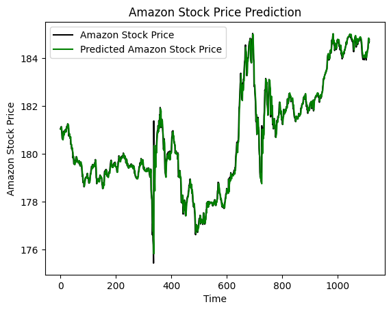

🔮 LSTM Time Series Forecasting
This project evaluates the effectiveness of Long Short-Term Memory (LSTM) neural networks in time series forecasting through two practical case studies:

📈 Amazon Stock Price Prediction — leveraging historical stock data from Yahoo Finance to train and test predictive performance.

🎰 Random Integer Forecasting — simulating roulette outcomes to explore how LSTM handles inherently random sequences.

The goal is to assess model behavior across structured (financial) and unstructured (random/chaotic) datasets, highlighting both the strengths and limitations of LSTM in real-world and edge-case forecasting.

# Project Overview

<h5>Effectiveness of LSTM Models in Time Series Forecasting</h5>

This project explores the effectiveness of Long Short-Term Memory (LSTM) neural networks in forecasting time series data.
We focus on two case studies:  
• Forecasting the closing price of Amazon stock 
• Predicting random integers.  
Our objective is to assess the predictive accuracy and model behavior in diverse scenarios.

<h5>Result:</h5>

